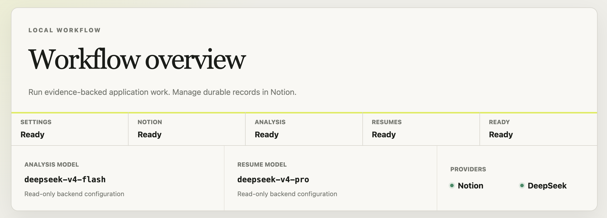
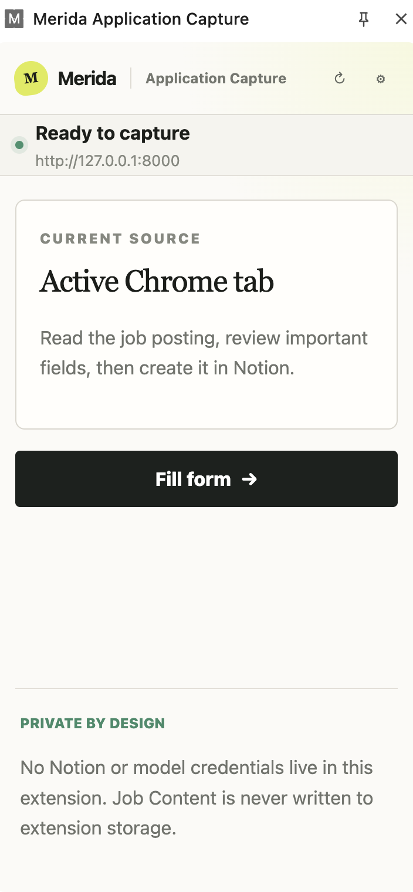
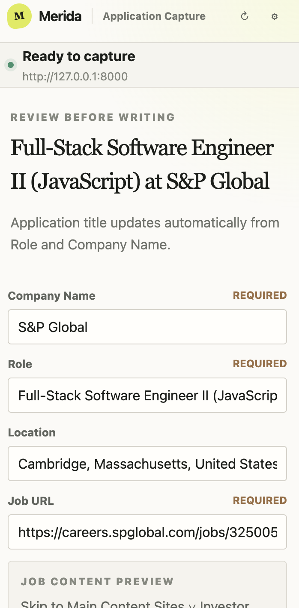
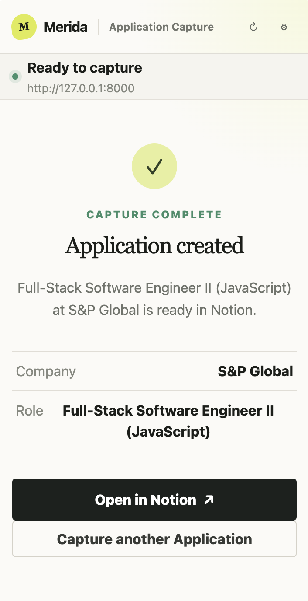
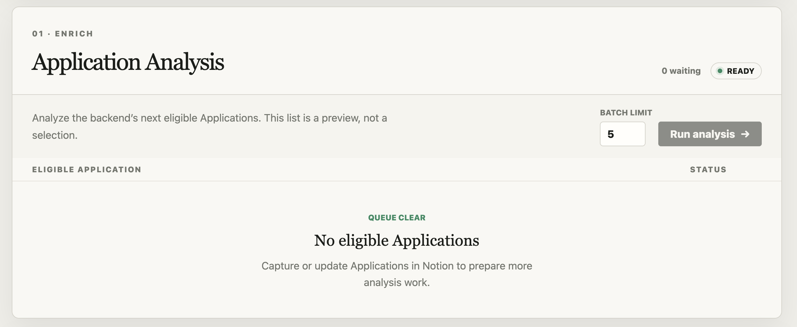
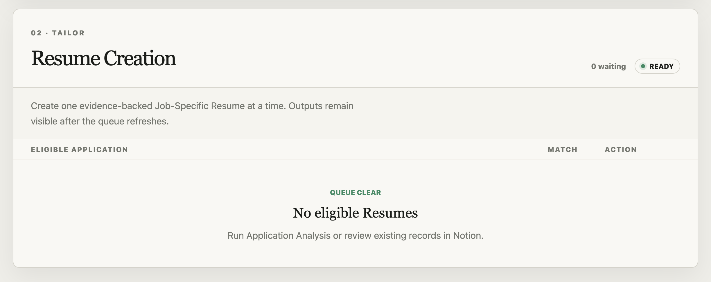

# Merida

Merida is a local-first job application workspace that captures roles from Chrome, analyzes fit, and creates evidence-backed tailored resumes using your own Notion workspace and AI provider keys.

<p align="center">
  <a href="#workflow-tour">Workflow tour</a> ·
  <a href="#run-locally">Run locally</a> ·
  <a href="docs/README.md">Documentation</a> ·
  <a href="#contributing">Contributing</a>
</p>

> Merida runs on your machine. It is a single-user operator app, not a hosted SaaS product. Screenshots in this README show the local product experience; there is no hosted demo.

## The workflow

Merida turns a job posting into a reviewable, evidence-backed application workflow:

| Stage | What happens | Surface |
| --- | --- | --- |
| **Capture** | Read the active job page, review the parsed fields, and create or reuse an Application in Notion. | Chrome side panel |
| **Analyze** | Process eligible Applications in bounded batches and persist evidence-backed analysis with a deterministic Match Score. | `/dashboard` |
| **Tailor** | Create one evidence-gated Job-Specific Resume, Resume Fit Analysis Note, and PDF for an eligible Application. | `/dashboard` + Notion |

Notion remains the durable record-management surface. The dashboard is an LLM process console for bounded Analysis and Resume Creation work.

## Workflow tour

The screenshots follow the intended path through the application. Each state is designed to keep the next human decision visible.

### See the local workflow at a glance

The dashboard makes provider readiness and the three workflow stages visible before work starts.

<p align="center">
  
</p>

### Start from the active job page

The Chrome side panel reads the current tab and lets you begin with **Fill form**. The extension does not hold Notion or model credentials.

<p align="center">
  
</p>

### Review before writing

Parsed company, role, location, URL, and job content stay visible for review. Fields can be corrected before anything is written to Notion.

<p align="center">
  
</p>

### Confirm the saved job

After **Create in Notion**, Merida shows a clear completion state and links to the durable record.

<p align="center">
  
</p>

### Analyze eligible applications

The dashboard processes the backend’s next eligible Applications in bounded batches. The visible list is a preview, not an accidental selection mechanism.

<p align="center">
  
</p>

### Create an evidence-backed resume

Once analysis is ready, Resume Creation produces a tailored resume only when the Master Resume contains enough supporting evidence.

<p align="center">
  
</p>

## Implementation

- **Local-first by design:** provider credentials and private workflow state stay behind the local backend boundary.
- **Review-first capture:** the extension collects evidence and asks for confirmation before writing a durable record.
- **Evidence-gated generation:** a tailored resume is blocked when the source resume cannot truthfully support the target role.
- **Deterministic matching:** model output is validated and paired with provider-independent evidence matching and scoring.

The deeper architecture, route contract, and AI workflow decisions are documented in [Architecture](docs/architecture.md), [Routes](docs/routes.md), and [AI and ML workflows](docs/ai-workflows.md).

## Privacy by design

- Merida runs locally on your machine.
- You bring your own Notion integration and DeepSeek API key.
- Notion tokens, database IDs, model keys, prompts, and filesystem paths stay in backend environment variables.
- The extension stores only its backend URL and Capture token; it does not store Notion credentials or full Job Content.

## Run locally

### Before you start

You will need:

- Node.js 22.18 or newer and npm 11.11 or newer
- Python 3.14.2 and `uv` 0.11.28 or newer for the supported local setup
- A Notion integration connected to existing **Applications**, **Resumes**, and **Notes** databases
- Exactly one `Master Resume` page in the Resumes database
- A DeepSeek API key

Merida validates the existing Notion workspace but does not create, rename, or mutate database properties. Start with the detailed [Notion schema guide](docs/notion-schema.md) before configuring the app.

### Quick start

1. Fork this repository, then clone your fork:

   ```sh
   git clone <your-fork-url>
   cd merida
   ```

2. Create the local environment file and fill in the required provider values:

   ```sh
   cp .env.example .env
   ```

   At minimum, configure a unique local `CAPTURE_TOKEN`, `NOTION_TOKEN`, `NOTION_DATABASE_ID`, `NOTION_RESUME_DATABASE_ID`, `NOTION_NOTES_DATABASE_ID`, and `DEEPSEEK_API_KEY`. Keep `.env` private. See [Operations](docs/operations.md) for the complete configuration reference.

3. Install the locked Node and Python environments, then build the dashboard, extension, and generated client:

   ```sh
   npm run setup
   npm run build
   ```

4. Load the extension in Chrome:

   - Open `chrome://extensions` and enable **Developer mode**.
   - Select **Load unpacked** and choose `apps/extension/dist`.
   - Copy the ID shown for **Merida Application Capture**.
   - Add the exact origin to `.env` before starting Merida:

     ```dotenv
     EXTENSION_ORIGIN=chrome-extension://PASTE_THE_EXTENSION_ID_HERE
     ```

5. Start Merida:

   ```sh
   npm start
   ```

6. Open [`http://127.0.0.1:8000/dashboard`](http://127.0.0.1:8000/dashboard). In the extension settings, save the same backend URL and `CAPTURE_TOKEN` from `.env`.

7. Open a job-posting webpage, use **Fill form**, review the fields, and choose **Create in Notion**. Then use the dashboard to run Application Analysis and Resume Creation.

For the complete setup, readiness checks, extension details, recovery process, and provider verification flow, see [Operations](docs/operations.md) and [Extension](docs/extension.md).

### Verify your setup

Run the credential-free acceptance gate after setup or after making changes:

```sh
npm test
```

The gate checks generated-client freshness, TypeScript, linting, browser-session behavior, the Python suite, production builds, removed demo surfaces, and the final repository boundary.

## Fork and adapt

Merida is intentionally designed to be adapted to your own workspace and job-search process. The most useful customization points are:

- Notion properties and relations, within the compatibility rules in [Notion schema](docs/notion-schema.md)
- Backend model and provider configuration in `.env`
- Capture, Analysis, and Resume Creation workflow behavior in their feature-owned modules
- Dashboard and extension presentation in `apps/web/` and `apps/extension/`

Keep private job content, resume content, prompts, provider payloads, and credentials out of commits, issues, and pull requests.

## FAQ

### Is Merida hosted?

No. Merida runs locally and uses your own Notion workspace and AI provider key.

### Where do my records live?

Applications, Resumes, and Resume Fit Analysis Notes live in your Notion workspace. Generated PDFs are saved locally under `app-data/export/` by default.

### Does the extension write immediately?

No. Capture is review-first: the extension prepares a form, and **Create in Notion** confirms the write.

### Where should I look when setup is blocked?

Start with the readiness and troubleshooting sections in [Operations](docs/operations.md), then verify the required properties and relations in [Notion schema](docs/notion-schema.md).

## Documentation

Use the [documentation index](docs/README.md) to choose the right level of detail:

- [Get started](docs/README.md#get-started) — operations, Notion schema, and extension setup
- [Understand the workflows](docs/README.md#understand-the-workflows) — capture, analysis, resume creation, frontend behavior, and AI/ML boundaries
- [Explore the codebase](docs/README.md#explore-the-codebase) — architecture, routes, ownership, and implementation structure

## Contributing

Bug reports, documentation improvements, and focused pull requests are welcome. For larger workflow or architecture changes, open an issue first so the scope can be discussed before implementation.

Please keep credentials and private job or resume content out of issues and pull requests. See the [documentation index](docs/README.md) for the contracts that a change should preserve.

## License

Merida is available under the [MIT License](LICENSE).
